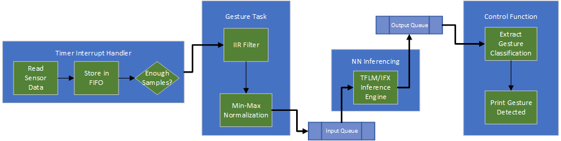

# Machine Learning: gesture classification

This code example demonstrates how to perform gesture classification based on motion sensor (accelerometer and gyroscope) data. The code example comes with a pre-trained model that classifies the following gestures: circle, square, and side-to-side.

For more details, see the [ModusToolbox Machine Learning solution](https://www.cypress.com/products/modustoolbox/machine-learning).

[Provide feedback on this code example.](https://cypress.co1.qualtrics.com/jfe/form/SV_1NTns53sK2yiljn?Q_EED=eyJVbmlxdWUgRG9jIElkIjoiQ0UyMzMxMTIiLCJTcGVjIE51bWJlciI6IjAwMi0zMzExMiIsIkRvYyBUaXRsZSI6Ik1hY2hpbmUgTGVhcm5pbmc6IGdlc3R1cmUgY2xhc3NpZmljYXRpb24iLCJyaWQiOiJucnNoIiwiRG9jIHZlcnNpb24iOiIxLjAuMCIsIkRvYyBMYW5ndWFnZSI6IkVuZ2xpc2giLCJEb2MgRGl2aXNpb24iOiJNQ0QiLCJEb2MgQlUiOiJJQ1ciLCJEb2MgRmFtaWx5IjoiUFNPQyJ9)

## Requirements

- [ModusToolbox&trade; software](https://www.cypress.com/products/modustoolbox-software-environment) v2.3 with ModusToolbox tools patch 2.3.1
- Board support package (BSP) minimum required version: 2.0.0
- Programming language: C
- Associated parts: All [PSoC&trade; 6 MCU](http://www.cypress.com/PSoC6) parts

## Supported toolchains (make variable 'TOOLCHAIN')

- GNU Arm® embedded compiler v9.3.1 (`GCC_ARM`) - Default value of `TOOLCHAIN`
- Arm compiler v6.13 (`ARM`)
- IAR C/C++ compiler v8.42.2 (`IAR`)

## Supported kits (make variable 'TARGET')

- [PSoC 62S2 Wi-Fi Bluetooth&reg; pioneer kit](https://www.cypress.com/CY8CKIT-062S2-43012) (`CY8CKIT-062S2-43012`) - Default value of `TARGET`
- [PSoC 64 "Secure Boot" Wi-Fi Bluetooth pioneer kit](http://www.cypress.com/CY8CKIT-064B0S2-4343W) (`CY8CKIT-064B0S2-4343W`)

## Hardware setup

Connect the CY8CKIT-028-SENSE shield to the Arduino header of your baseboard.

## Software setup

Install a terminal emulator if you don't have one. Instructions in this document use [Tera Term](https://ttssh2.osdn.jp/index.html.en).

By default, the Makefile uses a model that comes with the code example. The pre-trained Neural Net (NN) model is located in the *pretrained_models* folder. The output files location is set to *mtb_ml_gen*; the project name is set to *magic_wand*. You can use the MTB-ML Configurator Tool to open the *design.mtbml* model to evaluate the model.

## Using the code example

Create the project and open it using one of the following:

<details><summary><b>In Eclipse IDE for ModusToolbox</b></summary>

1. Click the **New Application** link in the **Quick Panel** (or, use **File** > **New** > **ModusToolbox Application**). This launches the [Project Creator](http://www.cypress.com/ModusToolboxProjectCreator) tool.

2. Pick a kit supported by the code example from the list shown in the **Project Creator - Choose Board Support Package (BSP)** dialog.

   When you select a supported kit, the example is reconfigured automatically to work with the kit. To work with a different supported kit later, use the [Library Manager](https://www.cypress.com/ModusToolboxLibraryManager) to choose the BSP for the supported kit. You can use the Library Manager to select or update the BSP and firmware libraries used in this application. To access the Library Manager, click the link from the **Quick Panel**.

   You can also just start the application creation process again and select a different kit.

   If you want to use the application for a kit not listed here, you may need to update the source files. If the kit does not have the required resources, the application may not work.

3. In the **Project Creator - Select Application** dialog, choose the example by enabling the checkbox.

4. Optionally, change the suggested **New Application Name**.

5. Enter the local path in the **Application(s) Root Path** field to indicate where the application needs to be created.

   Applications that can share libraries can be placed in the same root path.

6. Click **Create** to complete the application creation process.

For more details, see the [Eclipse IDE for ModusToolbox User Guide](https://www.cypress.com/MTBEclipseIDEUserGuide) (locally available at *{ModusToolbox install directory}/ide_{version}/docs/mt_ide_user_guide.pdf*).

</details>

<details><summary><b>In command-line interface (CLI)</b></summary>

ModusToolbox provides the Project Creator as both a GUI tool and a command line tool to easily create one or more ModusToolbox applications. See the "Project Creator Tools" section of the [ModusToolbox User Guide](https://www.cypress.com/ModusToolboxUserGuide) for more details.

Alternatively, you can manually create the application using the following steps:

1. Download and unzip this repository onto your local machine, or clone the repository.

2. Open a CLI terminal and navigate to the application folder.

   On Windows, use the command line "modus-shell" program provided in the ModusToolbox installation instead of a standard Windows command line application. This shell provides access to all ModusToolbox tools. You can access it by typing `modus-shell` in the search box in the Windows menu.

   In Linux and macOS, you can use any terminal application.

   **Note:** The cloned application contains a default BSP file (*TARGET_xxx.mtb*) in the *deps* folder. Use the [Library Manager](https://www.cypress.com/ModusToolboxLibraryManager) (`make modlibs` command) to select and download a different BSP file, if required. If the selected kit does not have the required resources or is not [supported](#supported-kits-make-variable-target), the application may not work.

3. Import the required libraries by executing the `make getlibs` command.

Various CLI tools include a `-h` option that prints help information to the terminal screen about that tool. For more details, see the [ModusToolbox User Guide](https://www.cypress.com/ModusToolboxUserGuide) (locally available at *{ModusToolbox install directory}/docs_{version}/mtb_user_guide.pdf*).

</details>

<details><summary><b>In Third-party IDEs</b></summary>

1. Follow the instructions from the **In command-line interface (CLI)** section to create the application, and import the libraries using the `make getlibs` command.

2. Export the application to a supported IDE using the `make <ide>` command.

   For a list of supported IDEs and more details, see the "Exporting to IDEs" section of the [ModusToolbox User Guide](https://www.cypress.com/ModusToolboxUserGuide) (locally available at *{ModusToolbox install directory}/docs_{version}/mtb_user_guide.pdf*.

3. Follow the instructions displayed in the terminal to create or import the application as an IDE project.

</details>

## Operation

If using a PSoC 64 "Secure" MCU kit (like CY8CKIT-064B0S2-4343W), the PSoC 64 device must be provisioned with keys and policies before being programmed. Follow the instructions in the ["Secure Boot" SDK user guide](https://www.cypress.com/documentation/software-and-drivers/psoc-64-secure-mcu-secure-boot-sdk-user-guide) to provision the device. If the kit is already provisioned, copy-paste the keys and policy folder to the application folder.

1. Connect the CY8CKIT-028-SENSE shield to the baseboard kit.

2. Connect the board to your PC using the provided USB cable through the KitProg3 USB connector.

3. Open a terminal program and select the KitProg3 COM port. Set the serial port parameters to 8N1 and 115200 baud.

4. Program the board using one of the following:

   <details><summary><b>Using Eclipse IDE for ModusToolbox</b></summary>

      1. Select the application project in the Project Explorer.

      2. In the **Quick Panel**, scroll down, and click **\<Application Name> Program (KitProg3_MiniProg4)**.
   </details>

   <details><summary><b>Using CLI</b></summary>

     From the terminal, execute the `make program` command to build and program the application using the default toolchain to the default target. You can specify a target and toolchain manually:
      ```
      make program TARGET=<BSP> TOOLCHAIN=<toolchain>
      ```

      Example:
      ```
      make program TARGET=CY8CPROTO-062-4343W TOOLCHAIN=GCC_ARM
      ```
      </details>

5. After programming, the application starts automatically. Confirm that "Gesture Classification Example" and some log data are printed on the UART terminal, the gesture classifications and confidence are updated continuously.

6. Hold the board with the following orientation while moving your arm to complete a gesture:

   **Figure 1. Board orientation**

   

7. Perform a counter-clockwise circle movement continuously and confirm that the UART terminal prints the gesture as **Circle** and the confidence of the circle increases past 70%.

8. Perform a counter-clockwise square movement continuously and confirm that the UART terminal prints the gesture as **Square** and the confidence of the square increases past 70%.

9. Perform a side-to-side movement (left <-> right) continuously and confirm that the UART terminal prints the gesture as **Side-to-side** and the confidence side-to-side increases past 70%.

10. When not performing any of the gestures above, confirm that the UART terminal prints the gesture as **None**.

    **Note**: If the confidence is lower than 70% then the gesture will register as **None**.

## Debugging

You can debug the example to step through the code. In the IDE, use the **\<Application Name> Debug (KitProg3_MiniProg4)** configuration in the **Quick Panel**. For more details, see the "Program and debug" section in the [Eclipse IDE for ModusToolbox User Guide](https://www.cypress.com/MTBEclipseIDEUserGuide).

**Note:** **(Only while debugging)** On the CM4 CPU, some code in `main()` may execute before the debugger halts at the beginning of `main()`. This means that some code executes twice - once before the debugger stops execution, and again after the debugger resets the program counter to the beginning of `main()`. See [KBA231071](https://community.cypress.com/docs/DOC-21143) to learn about this and for the workaround.

## Design and implementation

In this example, the firmware reads the data from a motion sensor (BMX160) to detect gestures. The data consists of 3-axis orientation data from the accelerometer and 3-axis orientation data from the gyroscope. A timer is configured to interrupt at 128 Hz. The interrupt handler reads all 6 axes through SPI and signals a task to process the batch of samples when the internal FIFO has 128-sample new samples. It performs an IIR filter and a min-max normalization on 128 samples at a time. This processed data is then fed to the inference engine. The inference engine outputs the confidence of the gesture for each of the four gesture classes. If the confidence passes a certain percent, the gesture is printed to the UART terminal.

The code example also provides a MTB-ML Configurator tool project file - *design.mtbml*, which points to the pre-trained NN model available in the *pretrained_models* folder.

This application uses FreeRTOS. There are three tasks in the system - *sensor task*, *NN task* and *control task*. They communicate with each other through queues. Sensor data is fed to the input queue, and the result is sent to the output queue.

   **Figure 2. Block diagram**

   

### Gesture classification model details

The convolutional neural network (CNN) model consists of two convolutional blocks and two full connection layers. Each convolutional block includes convolutional operations, including relu and max pooling, with the addition of a batch normalization layer after the first block. The convolutional layers act as feature extractors and provide abstract representations of the input sensor data in feature maps. They capture short-term dependencies (spatial relationships) of the data. In the CNN, features are extracted and then used as inputs of fully connected network, using softmax activation for classification.

   **Figure 3. Model diagram**


### Files and folders

```
|-- mtb_ml_gen/         # Contains the model files
|-- pretrained_models/  # Contains the H5 format model (used by the ML Configurator tool)
|-- source              # Contains the source code files for this example
   |- sensor.c/h        # Implements the sensor task
   |- processing.c/h    # Implements the IIR filter and normalization functions
   |- control.c/h       # Implements the control task
|-- nn                  # Contains NN-related files
   |- nn_utils.c/h      # Provides utility functions to manipulate the NN inputs/outputs
   |- nn.c/h            # Implements the NN task, which executes the inference engine
|-- fifo                # Contains a FIFO library
   |- cy_fifo.c/h       # Implements a FIFO in firmware
|-- FreeRTOSConfig.h    # FreeRTOS Configuration file
|-- design.mtbml        # MTB-ML Configurator tool project file
```
<br>

### Resources and settings

**Table 1. Application resources**

| Resource  |  Alias/object     |    Purpose     |
| :------- | :------------    | :------------ |
| UART (HAL)|cy_retarget_io_uart_obj| UART HAL object used by Retarget-IO for Debug UART port  |
| SPI (HAL) | spi | SPI HAL object to interface with the BMX160 sensor |
| Timer (HAL) | sensor_timer | Timer HAL object to periodically trigger samples to the sensor |

<br>

## Related resources

| Application notes                                            |                                                              |
| :----------------------------------------------------------- | :----------------------------------------------------------- |
| [AN228571](https://www.cypress.com/AN228571) – Getting started with PSoC 6 MCU on ModusToolbox | Describes PSoC 6 MCU devices and how to build your first application with ModusToolbox |
| [AN221774](https://www.cypress.com/AN221774) – Getting started with PSoC 6 MCU on PSoC Creator | Describes PSoC 6 MCU devices and how to build your first application with PSoC Creator |
| [AN210781](https://www.cypress.com/AN210781) – Getting started with PSoC 6 MCU with Bluetooth Low Energy connectivity on PSoC Creator | Describes PSoC 6 MCU with Bluetooth LE connectivity devices and how to build your first application with PSoC Creator |
| [AN215656](https://www.cypress.com/AN215656) – PSoC 6 MCU: dual-CPU system design | Describes the dual-CPU architecture in PSoC 6 MCU, and shows how to build a simple dual-CPU design |
| **Code examples**                                            |                                                              |
| [Using ModusToolbox](https://github.com/cypresssemiconductorco/Code-Examples-for-ModusToolbox-Software) | [Using PSoC Creator](https://www.cypress.com/documentation/code-examples/psoc-6-mcu-code-examples) |
| **Device documentation**                                     |                                                              |
| [PSoC 6 MCU datasheets](https://www.cypress.com/search/all?f[0]=meta_type%3Atechnical_documents&f[1]=resource_meta_type%3A575&f[2]=field_related_products%3A114026) | [PSoC 6 technical reference manuals](https://www.cypress.com/search/all/PSoC%206%20Technical%20Reference%20Manual?f[0]=meta_type%3Atechnical_documents&f[1]=resource_meta_type%3A583) |
| **Development kits**                                         | Buy at www.cypress.com                                       |
| [CY8CKIT-062-BLE](https://www.cypress.com/CY8CKIT-062-BLE) PSoC 6 Bluetooth LE pioneer kit | [CY8CKIT-062-WiFi-BT](https://www.cypress.com/CY8CKIT-062-WiFi-BT) PSoC 6 Wi-Fi Bluetooth pioneer kit |
| [CY8CPROTO-063-BLE](https://www.cypress.com/CY8CPROTO-063-BLE) PSoC 6 Bluetooth LE prototyping kit | [CY8CPROTO-062-4343W](https://www.cypress.com/CY8CPROTO-062-4343W) PSoC 6 Wi-Fi Bluetooth prototyping kit |
| [CY8CKIT-062S2-43012](https://www.cypress.com/CY8CKIT-062S2-43012) PSoC 62S2 Wi-Fi Bluetooth pioneer kit | [CY8CPROTO-062S3-4343W](https://www.cypress.com/CY8CPROTO-062S3-4343W) PSoC 62S3 Wi-Fi Bluetooth prototyping kit |
| [CYW9P62S1-43438EVB-01](https://www.cypress.com/CYW9P62S1-43438EVB-01) PSoC 62S1 Wi-Fi Bluetooth pioneer kit | [CYW9P62S1-43012EVB-01](https://www.cypress.com/CYW9P62S1-43012EVB-01) PSoC 62S1 Wi-Fi Bluetooth pioneer kit |
| [CY8CKIT-064B0S2-4343W](http://www.cypress.com/CY8CKIT-064B0S2-4343W) PSoC 64 "Secure Boot" Wi-Fi Bluetooth pioneer kit | [CY8CKIT-064S0S2-4343W](http://www.cypress.com/CY8CKIT-064S0S2-4343W) PSoC 64 "Standard Secure" AWS Wi-Fi Bluetooth pioneer kit           |
| **Libraries**                                                |                                                              |
| PSoC 6 peripheral driver library (PDL) and docs  | [mtb-pdl-cat1](https://github.com/cypresssemiconductorco/mtb-pdl-cat1) on GitHub |
| Hardware abstraction layer (HAL) Library and docs    | [mtb-hal-cat1](https://github.com/cypresssemiconductorco/mtb-hal-cat1) on GitHub |
| Retarget IO - A utility library to retarget the standard input/output (STDIO) messages to a UART port | [retarget-io](https://github.com/cypresssemiconductorco/retarget-io) on GitHub |
| **Middleware**                                               |                                                              |
| CapSense&trade; library and docs                                   | [capsense](https://github.com/cypresssemiconductorco/capsense) on GitHub |
| Links to all PSoC 6 MCU middleware                           | [psoc6-middleware](https://github.com/cypresssemiconductorco/psoc6-middleware) on GitHub |
| **Tools**                                                    |                                                              |
| [Eclipse IDE for ModusToolbox](https://www.cypress.com/modustoolbox) | The cross-platform, Eclipse-based IDE for IoT designers that supports application configuration and development targeting converged MCU and wireless systems. |
| [PSoC Creator™](https://www.cypress.com/products/psoc-creator-integrated-design-environment-ide) | The Cypress IDE for PSoC and FM0+ MCU development. |

<br>

## Other resources

Cypress provides a wealth of data at www.cypress.com to help you select the right device, and quickly and effectively integrate it into your design.

For PSoC 6 MCU devices, see [How to design with PSoC 6 MCU - KBA223067](https://community.cypress.com/docs/DOC-14644) in the Cypress community.

<br>

## Document history

Document Title: *CE233112* - *Machine Learning: gesture classification*

| Version | Description of Change |
| ------- | --------------------- |
| 1.0.0   | New code example      |
------

All other trademarks or registered trademarks referenced herein are the property of their respective owners.


-------------------------------------------------------------------------------

© Cypress Semiconductor Corporation, 2021. This document is the property of Cypress Semiconductor Corporation, an Infineon Technologies company, and its affiliates ("Cypress").  This document, including any software or firmware included or referenced in this document ("Software"), is owned by Cypress under the intellectual property laws and treaties of the United States and other countries worldwide.  Cypress reserves all rights under such laws and treaties and does not, except as specifically stated in this paragraph, grant any license under its patents, copyrights, trademarks, or other intellectual property rights.  If the Software is not accompanied by a license agreement and you do not otherwise have a written agreement with Cypress governing the use of the Software, then Cypress hereby grants you a personal, non-exclusive, nontransferable license (without the right to sublicense) (1) under its copyright rights in the Software (a) for Software provided in source code form, to modify and reproduce the Software solely for use with Cypress hardware products, only internally within your organization, and (b) to distribute the Software in binary code form externally to end users (either directly or indirectly through resellers and distributors), solely for use on Cypress hardware product units, and (2) under those claims of Cypress’s patents that are infringed by the Software (as provided by Cypress, unmodified) to make, use, distribute, and import the Software solely for use with Cypress hardware products.  Any other use, reproduction, modification, translation, or compilation of the Software is prohibited.
<br>
TO THE EXTENT PERMITTED BY APPLICABLE LAW, CYPRESS MAKES NO WARRANTY OF ANY KIND, EXPRESS OR IMPLIED, WITH REGARD TO THIS DOCUMENT OR ANY SOFTWARE OR ACCOMPANYING HARDWARE, INCLUDING, BUT NOT LIMITED TO, THE IMPLIED WARRANTIES OF MERCHANTABILITY AND FITNESS FOR A PARTICULAR PURPOSE.  No computing device can be absolutely secure.  Therefore, despite security measures implemented in Cypress hardware or software products, Cypress shall have no liability arising out of any security breach, such as unauthorized access to or use of a Cypress product.  CYPRESS DOES NOT REPRESENT, WARRANT, OR GUARANTEE THAT CYPRESS PRODUCTS, OR SYSTEMS CREATED USING CYPRESS PRODUCTS, WILL BE FREE FROM CORRUPTION, ATTACK, VIRUSES, INTERFERENCE, HACKING, DATA LOSS OR THEFT, OR OTHER SECURITY INTRUSION (collectively, "Security Breach").  Cypress disclaims any liability relating to any Security Breach, and you shall and hereby do release Cypress from any claim, damage, or other liability arising from any Security Breach.  In addition, the products described in these materials may contain design defects or errors known as errata which may cause the product to deviate from published specifications.  To the extent permitted by applicable law, Cypress reserves the right to make changes to this document without further notice. Cypress does not assume any liability arising out of the application or use of any product or circuit described in this document.  Any information provided in this document, including any sample design information or programming code, is provided only for reference purposes.  It is the responsibility of the user of this document to properly design, program, and test the functionality and safety of any application made of this information and any resulting product.  "High-Risk Device" means any device or system whose failure could cause personal injury, death, or property damage.  Examples of High-Risk Devices are weapons, nuclear installations, surgical implants, and other medical devices.  "Critical Component" means any component of a High-Risk Device whose failure to perform can be reasonably expected to cause, directly or indirectly, the failure of the High-Risk Device, or to affect its safety or effectiveness.  Cypress is not liable, in whole or in part, and you shall and hereby do release Cypress from any claim, damage, or other liability arising from any use of a Cypress product as a Critical Component in a High-Risk Device.  You shall indemnify and hold Cypress, including its affiliates, and its directors, officers, employees, agents, distributors, and assigns harmless from and against all claims, costs, damages, and expenses, arising out of any claim, including claims for product liability, personal injury or death, or property damage arising from any use of a Cypress product as a Critical Component in a High-Risk Device.  Cypress products are not intended or authorized for use as a Critical Component in any High-Risk Device except to the limited extent that (i) Cypress’s published data sheet for the product explicitly states Cypress has qualified the product for use in a specific High-Risk Device, or (ii) Cypress has given you advance written authorization to use the product as a Critical Component in the specific High-Risk Device and you have signed a separate indemnification agreement.
<br>
Cypress, the Cypress logo, and combinations thereof, WICED, ModusToolBox, PSoC, CapSense, EZ-USB, F-RAM, and Traveo are trademarks or registered trademarks of Cypress or a subsidiary of Cypress in the United States or in other countries.  For a more complete list of Cypress trademarks, visit cypress.com.  Other names and brands may be claimed as property of their respective owners.
