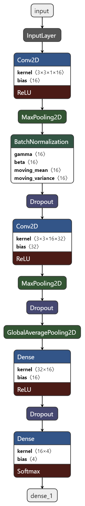

# Machine Learning: Gesture classification

This code example demonstrates how to perform gesture classification based on motion sensor (accelerometer and gyroscope) data. The code example comes with a pre-trained model that classifies the following gestures: circle, square, and side-to-side.

For more details, see the [ModusToolbox&trade; Machine Learning solution](https://www.infineon.com/cms/en/design-support/tools/sdk/modustoolbox-software/modustoolbox-machine-learning/).

[View this README on GitHub.](https://github.com/Infineon/mtb-example-ml-gesture-classification)

[Provide feedback on this code example.](https://cypress.co1.qualtrics.com/jfe/form/SV_1NTns53sK2yiljn?Q_EED=eyJVbmlxdWUgRG9jIElkIjoiQ0UyMzMxMTIiLCJTcGVjIE51bWJlciI6IjAwMi0zMzExMiIsIkRvYyBUaXRsZSI6Ik1hY2hpbmUgTGVhcm5pbmc6IEdlc3R1cmUgY2xhc3NpZmljYXRpb24iLCJyaWQiOiJucnNoIiwiRG9jIHZlcnNpb24iOiIzLjIuMCIsIkRvYyBMYW5ndWFnZSI6IkVuZ2xpc2giLCJEb2MgRGl2aXNpb24iOiJNQ0QiLCJEb2MgQlUiOiJJQ1ciLCJEb2MgRmFtaWx5IjoiUFNPQyJ9)

**Disclaimer:** The model provided is an example and may need customization for generalization or to meet certain performance criteria. If you require large-scale production, contact your sales representative.


## Requirements

- [ModusToolbox&trade;](https://www.infineon.com/modustoolbox) v3.1 or later (tested with v3.2)
- [ModusToolbox&trade; Machine Learning Pack v2.0](https://softwaretools.infineon.com/tools/com.ifx.tb.tool.modustoolboxpackmachinelearning) or later (tested with v2.0)
- Board support package (BSP) minimum required version: 4.0.0
- Programming language: C
- Other tools: Python 3.8.10 or later
- Associated parts: All [PSoC&trade; 6 MCU](https://www.infineon.com/cms/en/product/microcontroller/32-bit-psoc-arm-cortex-microcontroller/psoc-6-32-bit-arm-cortex-m4-mcu/) parts


## Supported toolchains (make variable 'TOOLCHAIN')

- GNU Arm&reg; Embedded Compiler v11.3.1 (`GCC_ARM`) – Default value of `TOOLCHAIN`
- Arm&reg; Compiler v6.16 (`ARM`)
- IAR C/C++ Compiler v9.30.1 (`IAR`)

> **Note:** `tflm` is not supported with `IAR`


## Supported kits (make variable 'TARGET')

- [PSoC&trade; 62S2 Wi-Fi Bluetooth&reg; Pioneer Kit](https://www.infineon.com/CY8CKIT-062S2-43012) (`CY8CKIT-062S2-43012`) - Default value of TARGET
- [PSoC&trade; 64 "Secure Boot" Wi-Fi Bluetooth&reg; Pioneer Kit](https://www.infineon.com/CY8CKIT-064B0S2-4343W) (`CY8CKIT-064B0S2-4343W`)


## Hardware setup

Connect the CY8CKIT-028-TFT shield to the baseboard header compatible with Arduino.

The code example also works with the CY8CKIT-028-SENSE shield. See the [Operation](#operation) section for more information.


## Software setup

Install a terminal emulator if you don't have one. Instructions in this document use [Tera Term](https://teratermproject.github.io/index-en.html).

Install the Machine Learning pack using this [link](https://softwaretools.infineon.com/tools/com.ifx.tb.tool.modustoolboxpackmachinelearning).

Install the Python interpreter and add it to the top of the system path in environmental variables. This code example is tested with [Python v3.8.10](https://www.python.org/downloads/release/python-3810/).

Use the ModusToolbox&trade;-ML Configurator tool (from *{ModusToolbox&trade; install directory}/packs/ModusToolbox-Machine-Learning-Pack/tools/ml-configurator/*) to load a pre-trained NN model and generate C files to be used with this code example. Alternatively, you can launch the configurator tool in Eclipse IDE for ModusToolbox&trade; from the Quick Launch window. For more information, see the [ModusToolbox&trade; Machine Learning user guide](https://www.infineon.com/ModusToolboxMLUserGuide).

By default, the Makefile uses a model that comes with the code example. The pre-trained neural net (NN) model is located in the *pretrained_models* folder. The output files location is set to **mtb_ml_gen**; the project name is set to *magic_wand*. You can use the ModusToolbox&trade;-ML Configurator tool to open the *design.mtbml* model to evaluate the model.

By default, the output files location is set to *mtb_ml_gen*. The project name is set to *MAGIC_WAND*. If you change any of these default settings, edit the following Makefile parameters of this code example:

Makefile parameter    | Description
 ---------------------| ---------------
`NN_TYPE=`            | Defines the input data format and NN weights. It can be `float`, `int16x16`, `int16x8`, or `int8x8`.
`NN_MODEL_NAME=`      | Defines the name of the model. The name comes from the *project name* defined in the ML Configurator tool. No quotes are used when changing the name of the model.
`NN_MODEL_FOLDER=`    | Sets the name where the model files will be placed. The name comes from the *output file location* defined in the ModusToolbox&trade;-ML Configurator tool.
`NN_INFERENCE_ENGINE` | Defines the inference engine to run. It has three options: `tflm`, `tflm_less`, and `ifx`

For information on available inference engines, see the [ModusToolbox&trade; Machine Learning user guide](https://www.infineon.com/ModusToolboxMLUserGuide).

> **Note**: The `tflm` and `tflm_less` inference engines only support `float` and `int8x8`.


## Using the code example

### Create the project

The ModusToolbox&trade; tools package provides the Project Creator as both a GUI tool and a command line tool.

<details><summary><b>Use Project Creator GUI</b></summary>

1. Open the Project Creator GUI tool.

   There are several ways to do this, including launching it from the dashboard or from inside the Eclipse IDE. For more details, see the [Project Creator user guide](https://www.infineon.com/ModusToolboxProjectCreator) (locally available at *{ModusToolbox&trade; install directory}/tools_{version}/project-creator/docs/project-creator.pdf*).

2. On the **Choose Board Support Package (BSP)** page, select a kit supported by this code example. See [Supported kits](#supported-kits-make-variable-target).

   > **Note:** To use this code example for a kit not listed here, you may need to update the source files. If the kit does not have the required resources, the application may not work.

3. On the **Select Application** page:

   a. Select the **Applications(s) Root Path** and the **Target IDE**.

   > **Note:** Depending on how you open the Project Creator tool, these fields may be pre-selected for you.

   b.	Select this code example from the list by enabling its check box.

   > **Note:** You can narrow the list of displayed examples by typing in the filter box.

   c. (Optional) Change the suggested **New Application Name** and **New BSP Name**.

   d. Click **Create** to complete the application creation process.

</details>

<details><summary><b>Use Project Creator CLI</b></summary>

The 'project-creator-cli' tool can be used to create applications from a CLI terminal or from within batch files or shell scripts. This tool is available in the *{ModusToolbox&trade; install directory}/tools_{version}/project-creator/* directory.

Use a CLI terminal to invoke the 'project-creator-cli' tool. On Windows, use the command-line 'modus-shell' program provided in the ModusToolbox&trade; installation instead of a standard Windows command-line application. This shell provides access to all ModusToolbox&trade; tools. You can access it by typing "modus-shell" in the search box in the Windows menu. In Linux and macOS, you can use any terminal application.

The following example clones the "[Gesture Classification](https://github.com/Infineon/mtb-example-ml-gesture-classification)" application with the desired name "GestureClassification" configured for the *CY8CKIT-062S2-43012* BSP into the specified working directory, *C:/mtb_projects*:

   ```
   project-creator-cli --board-id CY8CKIT-062S2-43012 --app-id mtb-example-ml-gesture-classification --user-app-name GestureClassification --target-dir "C:/mtb_projects"
   ```

The 'project-creator-cli' tool has the following arguments:

Argument | Description | Required/optional
---------|-------------|-----------
`--board-id` | Defined in the <id> field of the [BSP](https://github.com/Infineon?q=bsp-manifest&type=&language=&sort=) manifest | Required
`--app-id`   | Defined in the <id> field of the [CE](https://github.com/Infineon?q=ce-manifest&type=&language=&sort=) manifest | Required
`--target-dir`| Specify the directory in which the application is to be created if you prefer not to use the default current working directory | Optional
`--user-app-name`| Specify the name of the application if you prefer to have a name other than the example's default name | Optional

> **Note:** The project-creator-cli tool uses the `git clone` and `make getlibs` commands to fetch the repository and import the required libraries. For details, see the "Project creator tools" section of the [ModusToolbox&trade; tools package user guide](https://www.infineon.com/ModusToolboxUserGuide) (locally available at {ModusToolbox&trade; install directory}/docs_{version}/mtb_user_guide.pdf).

</details>

### Open the project

After the project has been created, you can open it in your preferred development environment.


<details><summary><b>Eclipse IDE</b></summary>

If you opened the Project Creator tool from the included Eclipse IDE, the project will open in Eclipse automatically.

For more details, see the [Eclipse IDE for ModusToolbox&trade; user guide](https://www.infineon.com/MTBEclipseIDEUserGuide) (locally available at *{ModusToolbox&trade; install directory}/docs_{version}/mt_ide_user_guide.pdf*).

</details>


<details><summary><b>Visual Studio (VS) Code</b></summary>

Launch VS Code manually, and then open the generated *{project-name}.code-workspace* file located in the project directory.

For more details, see the [Visual Studio Code for ModusToolbox&trade; user guide](https://www.infineon.com/MTBVSCodeUserGuide) (locally available at *{ModusToolbox&trade; install directory}/docs_{version}/mt_vscode_user_guide.pdf*).

</details>


<details><summary><b>Keil µVision</b></summary>

Double-click the generated *{project-name}.cprj* file to launch the Keil µVision IDE.

For more details, see the [Keil µVision for ModusToolbox&trade; user guide](https://www.infineon.com/MTBuVisionUserGuide) (locally available at *{ModusToolbox&trade; install directory}/docs_{version}/mt_uvision_user_guide.pdf*).

</details>


<details><summary><b>IAR Embedded Workbench</b></summary>

Open IAR Embedded Workbench manually, and create a new project. Then select the generated *{project-name}.ipcf* file located in the project directory.

For more details, see the [IAR Embedded Workbench for ModusToolbox&trade; user guide](https://www.infineon.com/MTBIARUserGuide) (locally available at *{ModusToolbox&trade; install directory}/docs_{version}/mt_iar_user_guide.pdf*).

</details>


<details><summary><b>Command line</b></summary>

If you prefer to use the CLI, open the appropriate terminal, and navigate to the project directory. On Windows, use the command-line 'modus-shell' program; on Linux and macOS, you can use any terminal application. From there, you can run various `make` commands.

For more details, see the [ModusToolbox&trade; tools package user guide](https://www.infineon.com/ModusToolboxUserGuide) (locally available at *{ModusToolbox&trade; install directory}/docs_{version}/mtb_user_guide.pdf*).

</details>


## Operation

If using a PSoC&trade; 64 "Secure" MCU kit (like CY8CKIT-064B0S2-4343W), the PSoC&trade; 64 device must be provisioned with keys and policies before being programmed. Follow the instructions in the ["Secure Boot" SDK user guide](https://www.infineon.com/dgdlac/Infineon-PSoC_64_Secure_MCU_Secure_Boot_SDK_User_Guide-Software-v07_00-EN.pdf?fileId=8ac78c8c7d0d8da4017d0f8c361a7666) to provision the device. If the kit is already provisioned, copy-paste the keys and policy folder to the application folder.

1. Connect the CY8CKIT-028-TFT shield to the baseboard.

   If using the CY8CKIT-028-SENSE shield, change `SHIELD_DATA_COLLECTION=CY_028_TFT_SHIELD` in the Makefile based on the shields revision.

   To check the version of CY8CKIT-028-SENSE, locate the sticker on the bottom of the shield's box which indicates the revision.

   - If the shield is Rev "**", use `SHIELD_DATA_COLLECTION=CY_028_SENSE_SHIELD_v1`.
   - If the shield is Rev "*B", use `SHIELD_DATA_COLLECTION=CY_028_SENSE_SHIELD_v2`.

2. Connect the board to your PC using the provided USB cable through the KitProg3 USB connector.

3. Open a terminal program and select the KitProg3 COM port. Set the serial port parameters to 8N1 and 115200 baud.

4. Program the board using one of the following:

   <details><summary><b>Using Eclipse IDE</b></summary>

      1. Select the application project in the Project Explorer.

      2. In the **Quick Panel**, scroll down, and click **\<Application Name> Program (KitProg3_MiniProg4)**.
   </details>


   <details><summary><b>In other IDEs</b></summary>

   Follow the instructions in your preferred IDE.
   </details>


   <details><summary><b>Using CLI</b></summary>

     From the terminal, execute the `make program` command to build and program the application using the default toolchain to the default target. The default toolchain is specified in the application's Makefile but you can override this value manually:
      ```
      make program TOOLCHAIN=<toolchain>
      ```

      Example:
      ```
      make program TOOLCHAIN=GCC_ARM
      ```
   </details>

5. After programming, the application starts automatically. Confirm that "Gesture Classification Example" and some log data are printed on the UART terminal. The gesture classifications and confidence are updated continuously.

6. Hold the board with the orientation as shown below while moving your arm to complete a gesture:

   **Figure 1. Board orientation**

   

7. Perform a counter-clockwise circle movement continuously. Confirm that the UART terminal prints the gesture as [**Circle**](https://github.com/Infineon/mtb-example-ml-gesture-classification/blob/master/images/circle.gif), and the confidence of the circle shape increases past 60%. For best results, repeatedly perform circle movements each in one second, with a diameter of one foot.

   **Figure 2. Circle gesture**

   


8. Perform a counter-clockwise square movement continuously. Confirm that the UART terminal prints the gesture as [**Square**](https://github.com/Infineon/mtb-example-ml-gesture-classification/blob/master/images/square.gif), and the confidence of the square shape increases past 60%. For best results, repeatedly perform square shape movements, each in two seconds, with a side length of one foot.

   **Figure 3. Square gesture**

   

9. Perform a side-to-side movement (left <-> right) continuously. Confirm that the UART terminal prints the gesture as [**Side-to-side**](https://github.com/Infineon/mtb-example-ml-gesture-classification/blob/master/images/side-to-side.gif), and the confidence increases past 60%. For best results, repeatedly perform the one-foot-wide left-to-right movement in half-a-second each.

   **Figure 4. Side-to-side gesture**

   

10. When not performing any of these gestures, confirm that the UART terminal prints the gesture as **None**.

> **Note:** If the confidence is lower than 60%, the gesture will register as **None**.

> **Note:** Figures 2-4 above may have low frame rates. Click on the embedded links in steps 7, 8, and 9 to redirect to GitHub for better quality.


## Debugging

You can debug the example to step through the code. 

<details><summary><b>In Eclipse IDE</b></summary>

Use the **\<Application Name> Debug (KitProg3_MiniProg4)** configuration in the **Quick Panel**. For details, see the "Program and debug" section in the [Eclipse IDE for ModusToolbox&trade; user guide](https://www.infineon.com/MTBEclipseIDEUserGuide).


> **Note:** **(Only while debugging)** On the CM4 CPU, some code in `main()` may execute before the debugger halts at the beginning of `main()`. This means that some code executes twice – once before the debugger stops execution, and again after the debugger resets the program counter to the beginning of `main()`. See [KBA231071](https://community.infineon.com/docs/DOC-21143) to learn about this and for the workaround.

</details>

<details><summary><b>In other IDEs</b></summary>

Follow the instructions in your preferred IDE.
</details>


## Design and implementation

In this example, the firmware reads the data from a motion sensor (BMX160) to detect gestures.

The data consists of a 3-axis orientation data from the accelerometer and the gyroscope. A timer is configured to interrupt at 128 Hz. The interrupt handler reads all 6 axes through SPI and signals a task to process the batch of samples when the internal FIFO has 128 new samples. It performs an IIR filter and a min-max normalization on 128 samples at a time. This processed data is then fed to the inference engine. The inference engine outputs the confidence of the gesture for each of the four gesture classes. If the confidence passes a certain percentage, the gesture is printed to the UART terminal.

The code example also provides a ModusToolbox&trade;-ML Configurator tool project file - *design.mtbml*, which points to the pre-trained NN model available in the *pretrained_models* folder.

This application uses FreeRTOS with *gesture task*. The gesture task pre-processes all data and passes the data to the inference engine. FreeRTOS is used so that the code example can be expanded.

**Figure 5. Block diagram**


### Gesture classification model

The convolutional neural network (CNN) model consists of two convolutional blocks and two full-connection layers. Each convolutional block includes convolutional operations, including rectified linear unit (ReLU) and max pooling, with the addition of a batch normalization layer after the first block.

The convolutional layers act as feature extractors and provide abstract representations of the input sensor data in feature maps. They capture short-term dependencies (spatial relationships) of the data. In CNN, features are extracted and then used as inputs to a fully connected network, using softmax activation for classification.

**Figure 6. Model diagram**




## Model generation

This code example includes the scripts used to generate the "Magic_wand_model.h5" model. These scripts allow the user to collect data, train a model, and deploy the model to a PSoC&trade; device. These scripts are used as a starting place and show the flow you must go through to produce a model.


### Collect data

The user collects the data to train a model. The gesture classification has code included to print the IMU data out to a terminal. That data is then stored in a text file with the use of a script.

Do the following to collect the data:

1. Open *gesture.h* in the project and change `GESTURE_DATA_COLLECTION_MODE 0u` to `GESTURE_DATA_COLLECTION_MODE 1u`.

2. Remove all files in your project's *train/gesture_data* folder. This is the data used to train the current model.

3. Program the device using the steps from the [Operation](#operation) section. Do not open a terminal window.

4. Open **modus-shell** and navigate to the *train* directory in the current project.

5. Install the requirements with the following command:

   ```
   pip install -r requirements.txt
   ```
6. Run the following command:

   ```
   ./collect.sh <COM PORT> <GESTURE NAME> <PERSON NAME>

   ```
   The port the device is connected to should be the COM port. The gesture name should be limited to 16 characters. The model is set up for a repeatable gesture such as a circle or square.

7. Perform the named gesture and press **C** to start capturing data. Continuously repeat the gesture until a few minutes of data is collected.

8. Press **S** to stop the data capture.

9. Repeat steps 5 through 7 for each gesture. Scripts support four distinct gestures; one of those gestures should be a "negative" or "no_gesture" classification. All data is stored in TXT files in your project's *train/gesture_data* folder.


### Generate a model

After the data collection, generate a model using that data.

Do the following to generate a model:

1. Open **modus-shell** and navigate to the *train* directory in the current project.

2. Install the requirements with following command if not previously done in the **Collect Data** section:

   ```
   pip install -r requirements.txt
   ```

3. Run the following command to run the different scripts that process the data, train the model, and validate the model:

   ```
   ./generate_model.sh
   ```
   The following are generated:

   - Generated model called *User_generated_model.h5/tflite* is stored in *pretrained_models*.

   - Pruned model called *User_generated_model_pruned.h5* is generated with 50 percent pruning and allows for the use of sparsity in the ML Configurator.

   - *gesture_names.h* is generated in your project's *train* folder that stores the names of the user-defined gestures. This is used when printing gesture info out to a terminal.

   - *calibration.npz* file is generated in your project's *train* folder that stores the data used for model calibration or validation.


### Model deployment

Do the following to deploy the generated model to the device.

1. Open the *gesture.h* file and change  `GESTURE_DATA_COLLECTION_MODE 1u` to `GESTURE_DATA_COLLECTION_MODE 0u`.

2. Open **ML Configurator** from the **Quick Panel**.

3. For the **pretrained model** parameter, import the newly generated model from *pretrained_models/User_generated_model.h5/tflite*.

4. If the *User_generated_model_pruned.h5* model is used, select **Enable Sparsity** in ML Configurator.

5. If the selected inference engine is **TFLM** and **Enable quantization** is selected, under **Model Calibration**, set the **Dataset structure** to **NPZ** and the **Path** to *train/calibration.npz*. The *calibration.npz* data can also be used for model validation.

6. Click **Generate Source**.

7. Program the device using the steps from the [Operation](#operation) section.

8. Perform the trained gestures and validate the output in a terminal window.

> **Note:** This code example uses the same flow as described in this section to function. When you run the `./generate_model.sh` command, the code example will not operate as intended. The data used to train the current model is stored in the *gesture_data* file and can be used to train a model.


### Files and folders

```
|-- mtb_ml_gen/         	# Contains the model files
|-- pretrained_models/  	# Contains the H5 format model (used by the ML Configurator tool)
|-- source              	# Contains the source code files for this example
   |- gesture.c/h       	# Implements the gesture task
   |- processing.c/h    	# Implements the IIR filter and normalization functions
   |- control.c/h       	# Implements the control task
   |- sensor.c/h			# Sets up the IMU and collects data
|-- fifo                	# Contains a FIFO library
   |- cy_fifo.c/h       	# Implements a FIFO in firmware
|-- FreeRTOSConfig.h    	# FreeRTOS configuration file
|-- design.mtbml        	# ModusToolbox-ML Configurator tool project file
|--train					# Scripts for training and generating a model
   |- collect.sh			# Contains the script to collect user data and store it in a TXT file
   |- generate_model.sh		# Contains the scripts to generate a model based on the user data
   |- calibration_data.npz	# Contains data that can be used for calibration or validation of a model
   |- gesture_names.h		# Contains the names of the gestures, generated when generate_model.sh is used
```

> **Note:** This code example supports CY8CKIT-028-TFT and the CY8CKIT-028-SENSE shields. These shields have different sensors; to support both, a change is made to the *bmi160_defs.h* file. When using CY8CKIT-028-TFT, `BMI160_CHIP_ID` is set to `0xD1`. When using CY8CKIT-028-SENSE, `BMI160_CHIP_ID` is set to `0xD8`. This is done through a series of `PREBUILD` commands in the Makefile.


### Resources and settings

**Table 1. Application resources**

 Resource  |  Alias/object     |    Purpose
 :------- | :------------    | :------------
 UART (HAL)|cy_retarget_io_uart_obj| UART HAL object used by Retarget-IO for Debug UART port  |
 SPI (HAL) | spi | SPI HAL object to interface with the BMX160 sensor
 Timer (HAL) | sensor_timer | Timer HAL object to periodically trigger samples to the sensor

<br>

## Related resources

Resources  | Links
-----------|----------------------------------
Application notes  | [AN228571](https://www.infineon.com/AN228571) – Getting started with PSoC&trade; 6 MCU on ModusToolbox&trade; <br>  [AN215656](https://www.infineon.com/AN215656) – PSoC&trade; 6 MCU: Dual-CPU system design
Code examples  | [Using ModusToolbox&trade;](https://github.com/Infineon/Code-Examples-for-ModusToolbox-Software) on GitHub
Device documentation | [PSoC&trade; 6 MCU datasheets](https://documentation.infineon.com/html/psoc6/bnm1651211483724.html) <br> [PSoC&trade; 6 technical reference manuals](https://documentation.infineon.com/html/psoc6/zrs1651212645947.html
Development kits | Select your kits from the [Evaluation board finder](https://www.infineon.com/cms/en/design-support/finder-selection-tools/product-finder/evaluation-board).
Libraries on GitHub  | [mtb-pdl-cat1](https://github.com/Infineon/mtb-pdl-cat1) – PSoC&trade; 6 Peripheral Driver Library (PDL)  <br> [mtb-hal-cat1](https://github.com/Infineon/mtb-hal-cat1) – Hardware Abstraction Layer (HAL) library <br> [retarget-io](https://github.com/Infineon/retarget-io) – Utility library to retarget STDIO messages to a UART port
Middleware on GitHub  | [capsense](https://github.com/Infineon/capsense) – CAPSENSE&trade; library and documents <br> [psoc6-middleware](https://github.com/Infineon/modustoolbox-software#psoc-6-middleware-libraries) – Links to all PSoC&trade; 6 MCU middleware
Tools  | [ModusToolbox&trade;](https://www.infineon.com/modustoolbox) – ModusToolbox&trade; software is a collection of easy-to-use libraries and tools enabling rapid development with Infineon MCUs for applications ranging from wireless and cloud-connected systems, edge AI/ML, embedded sense and control, to wired USB connectivity using PSoC&trade; Industrial/IoT MCUs, AIROC&trade; Wi-Fi and Bluetooth&reg; connectivity devices, XMC&trade; Industrial MCUs, and EZ-USB&trade;/EZ-PD&trade; wired connectivity controllers. ModusToolbox&trade; incorporates a comprehensive set of BSPs, HAL, libraries, configuration tools, and provides support for industry-standard IDEs to fast-track your embedded application development.

<br>

## Other resources

Infineon provides a wealth of data at [www.infineon.com](https://www.infineon.com) to help you select the right device, and quickly and effectively integrate it into your design.

For PSoC&trade; 6 MCU devices, see [How to design with PSoC&trade; 6 MCU - KBA223067](https://community.infineon.com/docs/DOC-14644) in the Infineon Developer Community.


## Document history

Document title: *CE233112* – *Machine Learning: Gesture classification*

 Version | Description of change
 ------- | ---------------------
 1.0.0   | New code example
 1.1.0   | Updated model, new CY_028_TFT support, better gesture description
 2.0.0   | Update includes support for MTBML 1.2 and support for machine learning middleware
 3.0.0   | Update to ModusToolbox&trade; 3.0 and Machine Learning 2.0
 3.1.0   | Update to support model pruning and sparsity <br> Update to use the new mtb_ml_utils_quantize() function.
 3.2.0   | Update to use BMX160 script for changing chip ID. Add protobuf to requirements.txt and Updated to support ModusToolbox&trade; 3.2.

<br>

All referenced product or service names and trademarks are the property of their respective owners.

The Bluetooth&reg; word mark and logos are registered trademarks owned by Bluetooth SIG, Inc., and any use of such marks by Infineon is under license.


---------------------------------------------------------

© Cypress Semiconductor Corporation, 2021-2024. This document is the property of Cypress Semiconductor Corporation, an Infineon Technologies company, and its affiliates ("Cypress").  This document, including any software or firmware included or referenced in this document ("Software"), is owned by Cypress under the intellectual property laws and treaties of the United States and other countries worldwide.  Cypress reserves all rights under such laws and treaties and does not, except as specifically stated in this paragraph, grant any license under its patents, copyrights, trademarks, or other intellectual property rights.  If the Software is not accompanied by a license agreement and you do not otherwise have a written agreement with Cypress governing the use of the Software, then Cypress hereby grants you a personal, non-exclusive, nontransferable license (without the right to sublicense) (1) under its copyright rights in the Software (a) for Software provided in source code form, to modify and reproduce the Software solely for use with Cypress hardware products, only internally within your organization, and (b) to distribute the Software in binary code form externally to end users (either directly or indirectly through resellers and distributors), solely for use on Cypress hardware product units, and (2) under those claims of Cypress’s patents that are infringed by the Software (as provided by Cypress, unmodified) to make, use, distribute, and import the Software solely for use with Cypress hardware products.  Any other use, reproduction, modification, translation, or compilation of the Software is prohibited.
<br>
TO THE EXTENT PERMITTED BY APPLICABLE LAW, CYPRESS MAKES NO WARRANTY OF ANY KIND, EXPRESS OR IMPLIED, WITH REGARD TO THIS DOCUMENT OR ANY SOFTWARE OR ACCOMPANYING HARDWARE, INCLUDING, BUT NOT LIMITED TO, THE IMPLIED WARRANTIES OF MERCHANTABILITY AND FITNESS FOR A PARTICULAR PURPOSE.  No computing device can be absolutely secure.  Therefore, despite security measures implemented in Cypress hardware or software products, Cypress shall have no liability arising out of any security breach, such as unauthorized access to or use of a Cypress product. CYPRESS DOES NOT REPRESENT, WARRANT, OR GUARANTEE THAT CYPRESS PRODUCTS, OR SYSTEMS CREATED USING CYPRESS PRODUCTS, WILL BE FREE FROM CORRUPTION, ATTACK, VIRUSES, INTERFERENCE, HACKING, DATA LOSS OR THEFT, OR OTHER SECURITY INTRUSION (collectively, "Security Breach").  Cypress disclaims any liability relating to any Security Breach, and you shall and hereby do release Cypress from any claim, damage, or other liability arising from any Security Breach.  In addition, the products described in these materials may contain design defects or errors known as errata which may cause the product to deviate from published specifications. To the extent permitted by applicable law, Cypress reserves the right to make changes to this document without further notice. Cypress does not assume any liability arising out of the application or use of any product or circuit described in this document. Any information provided in this document, including any sample design information or programming code, is provided only for reference purposes.  It is the responsibility of the user of this document to properly design, program, and test the functionality and safety of any application made of this information and any resulting product.  "High-Risk Device" means any device or system whose failure could cause personal injury, death, or property damage.  Examples of High-Risk Devices are weapons, nuclear installations, surgical implants, and other medical devices.  "Critical Component" means any component of a High-Risk Device whose failure to perform can be reasonably expected to cause, directly or indirectly, the failure of the High-Risk Device, or to affect its safety or effectiveness.  Cypress is not liable, in whole or in part, and you shall and hereby do release Cypress from any claim, damage, or other liability arising from any use of a Cypress product as a Critical Component in a High-Risk Device. You shall indemnify and hold Cypress, including its affiliates, and its directors, officers, employees, agents, distributors, and assigns harmless from and against all claims, costs, damages, and expenses, arising out of any claim, including claims for product liability, personal injury or death, or property damage arising from any use of a Cypress product as a Critical Component in a High-Risk Device. Cypress products are not intended or authorized for use as a Critical Component in any High-Risk Device except to the limited extent that (i) Cypress's published data sheet for the product explicitly states Cypress has qualified the product for use in a specific High-Risk Device, or (ii) Cypress has given you advance written authorization to use the product as a Critical Component in the specific High-Risk Device and you have signed a separate indemnification agreement.
<br>
Cypress, the Cypress logo, and combinations thereof, ModusToolbox, PSoC, CAPSENSE, EZ-USB, F-RAM, and TRAVEO are trademarks or registered trademarks of Cypress or a subsidiary of Cypress in the United States or in other countries. For a more complete list of Cypress trademarks, visit www.infineon.com. Other names and brands may be claimed as property of their respective owners.
